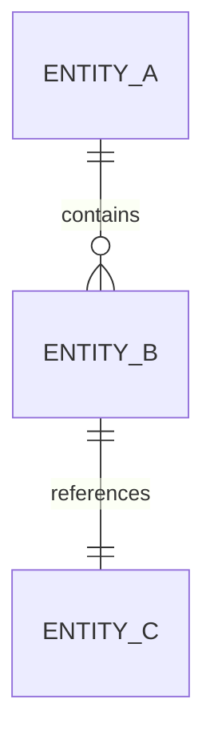
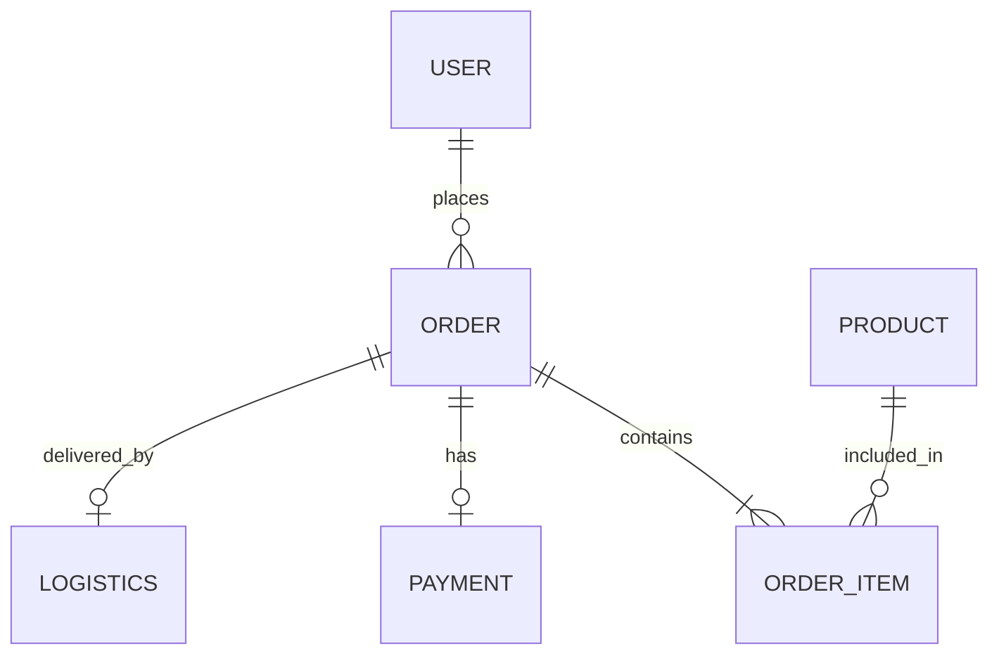

# Skill: data-model-designer

## 基本信息
- **名称**: data-model-designer
- **版本**: 1.0.0
- **所属部门**: 研发部
- **优先级**: P0

## 功能描述
根据业务需求设计数据库数据模型，包括实体关系图(ERD)、表结构设计、索引优化、数据字典等。支持多数据库类型，自动生成DDL语句。

## 触发条件
- 命令触发: `/data-model-designer`
- 自然语言触发:
  - "设计数据模型"
  - "创建数据库设计"
  - "生成表结构"
  - "设计ER图"

## 输入参数
| 参数名 | 类型 | 必填 | 描述 |
|--------|------|------|------|
| business_requirement | string | 是 | 业务需求描述 |
| db_type | string | 否 | 数据库类型：mysql/postgresql/oracle，默认mysql |
| naming_convention | string | 否 | 命名规范：snake_case/camelCase |
| generate_ddl | boolean | 否 | 是否生成DDL语句，默认true |

## 执行流程
1. **实体识别** - 从需求中识别核心实体
2. **关系分析** - 分析实体间的关系（1:1, 1:N, N:M）
3. **属性定义** - 定义每个实体的属性
4. **范式优化** - 进行范式检查和优化
5. **索引设计** - 设计查询优化索引
6. **DDL生成** - 生成数据库DDL语句
7. **数据字典** - 生成数据字典文档

## 输出格式

### 数据模型设计文档
```markdown
# 数据模型设计文档

## 1. 概述

### 1.1 设计目标
{设计目标和范围}

### 1.2 数据库选型
| 项目 | 选型 |
|------|------|
| 数据库类型 | MySQL 8.0 |
| 字符集 | utf8mb4 |
| 排序规则 | utf8mb4_general_ci |
| 存储引擎 | InnoDB |

## 2. 实体关系图



## 3. 表结构设计

### 3.1 {表名}

**表说明**: {表描述}

| 字段名 | 数据类型 | 可空 | 默认值 | 说明 |
|--------|----------|------|--------|------|
| id | BIGINT | NO | AUTO_INCREMENT | 主键ID |

**索引设计**:
| 索引名 | 索引字段 | 索引类型 | 说明 |
|--------|----------|----------|------|
| PRIMARY | id | PRIMARY | 主键索引 |

## 4. DDL语句

```sql
CREATE TABLE `table_name` (
  `id` BIGINT NOT NULL AUTO_INCREMENT COMMENT '主键ID',
  PRIMARY KEY (`id`)
) ENGINE=InnoDB DEFAULT CHARSET=utf8mb4 COMMENT='表描述';
```

## 5. 数据字典

### 5.1 状态码表
| 状态值 | 状态名 | 说明 |
|--------|--------|------|
| 0 | 待处理 | 初始状态 |

## 6. 设计规范

### 6.1 命名规范
- 表名：小写下划线，如 `user_order`
- 字段名：小写下划线，如 `create_time`
- 索引名：`idx_表名_字段名` 或 `uk_表名_字段名`

### 6.2 公共字段
所有业务表必须包含以下公共字段：
- `creator` VARCHAR(64) - 创建人
- `create_time` DATETIME - 创建时间
- `updater` VARCHAR(64) - 更新人
- `update_time` DATETIME - 更新时间
- `deleted` TINYINT - 逻辑删除标识
```

## 质量标准
- 满足第三范式(3NF)要求
- 索引设计覆盖常用查询
- 字段类型选择合理
- 命名规范统一
- DDL语句可执行

## 使用示例

### 示例1：设计订单系统数据模型

**输入**:
```
业务需求：电商订单系统
- 用户可以创建订单购买商品
- 订单包含多个商品明细
- 支持多种支付方式
- 订单有多个状态流转
- 需要记录物流信息
```

**输出**:
```markdown
# 电商订单系统数据模型设计文档

## 1. 概述

### 1.1 设计目标
设计电商订单系统的数据库模型，支持订单创建、支付、发货、售后等完整业务流程。

### 1.2 数据库选型
| 项目 | 选型 |
|------|------|
| 数据库类型 | MySQL 8.0 |
| 字符集 | utf8mb4 |
| 排序规则 | utf8mb4_general_ci |
| 存储引擎 | InnoDB |

## 2. 实体关系图



## 3. 表结构设计

### 3.1 订单主表 (trade_order)

**表说明**: 订单主信息表

| 字段名 | 数据类型 | 可空 | 默认值 | 说明 |
|--------|----------|------|--------|------|
| id | BIGINT | NO | AUTO_INCREMENT | 主键ID |
| tenant_id | BIGINT | NO | - | 租户ID |
| order_no | VARCHAR(64) | NO | - | 订单编号 |
| user_id | BIGINT | NO | - | 用户ID |
| total_amount | DECIMAL(18,2) | NO | 0.00 | 订单总金额 |
| pay_amount | DECIMAL(18,2) | NO | 0.00 | 实付金额 |
| discount_amount | DECIMAL(18,2) | NO | 0.00 | 优惠金额 |
| freight_amount | DECIMAL(18,2) | NO | 0.00 | 运费金额 |
| status | TINYINT | NO | 0 | 订单状态 |
| pay_status | TINYINT | NO | 0 | 支付状态 |
| pay_time | DATETIME | YES | NULL | 支付时间 |
| pay_type | TINYINT | YES | NULL | 支付方式 |
| receiver_name | VARCHAR(64) | NO | - | 收货人姓名 |
| receiver_phone | VARCHAR(20) | NO | - | 收货人电话 |
| receiver_address | VARCHAR(500) | NO | - | 收货地址 |
| remark | VARCHAR(500) | YES | NULL | 订单备注 |
| creator | VARCHAR(64) | NO | - | 创建人 |
| create_time | DATETIME | NO | CURRENT_TIMESTAMP | 创建时间 |
| updater | VARCHAR(64) | NO | - | 更新人 |
| update_time | DATETIME | NO | CURRENT_TIMESTAMP | 更新时间 |
| deleted | TINYINT | NO | 0 | 删除标识 |

**索引设计**:
| 索引名 | 索引字段 | 索引类型 | 说明 |
|--------|----------|----------|------|
| PRIMARY | id | PRIMARY | 主键索引 |
| uk_tenant_order | tenant_id, order_no, deleted | UNIQUE | 订单号唯一 |
| idx_tenant_user | tenant_id, user_id | NORMAL | 用户订单查询 |
| idx_tenant_status | tenant_id, status | NORMAL | 状态查询 |
| idx_tenant_time | tenant_id, create_time | NORMAL | 时间范围查询 |

### 3.2 订单明细表 (trade_order_item)

**表说明**: 订单商品明细表

| 字段名 | 数据类型 | 可空 | 默认值 | 说明 |
|--------|----------|------|--------|------|
| id | BIGINT | NO | AUTO_INCREMENT | 主键ID |
| tenant_id | BIGINT | NO | - | 租户ID |
| order_id | BIGINT | NO | - | 订单ID |
| order_no | VARCHAR(64) | NO | - | 订单编号 |
| product_id | BIGINT | NO | - | 商品ID |
| product_name | VARCHAR(255) | NO | - | 商品名称 |
| sku_id | BIGINT | NO | - | SKU ID |
| sku_code | VARCHAR(64) | NO | - | SKU编码 |
| sku_name | VARCHAR(255) | NO | - | SKU名称 |
| price | DECIMAL(18,2) | NO | 0.00 | 商品单价 |
| quantity | INT | NO | 1 | 购买数量 |
| total_amount | DECIMAL(18,2) | NO | 0.00 | 小计金额 |
| discount_amount | DECIMAL(18,2) | NO | 0.00 | 优惠金额 |
| pay_amount | DECIMAL(18,2) | NO | 0.00 | 实付金额 |
| creator | VARCHAR(64) | NO | - | 创建人 |
| create_time | DATETIME | NO | CURRENT_TIMESTAMP | 创建时间 |
| updater | VARCHAR(64) | NO | - | 更新人 |
| update_time | DATETIME | NO | CURRENT_TIMESTAMP | 更新时间 |
| deleted | TINYINT | NO | 0 | 删除标识 |

**索引设计**:
| 索引名 | 索引字段 | 索引类型 | 说明 |
|--------|----------|----------|------|
| PRIMARY | id | PRIMARY | 主键索引 |
| idx_tenant_order | tenant_id, order_id | NORMAL | 订单明细查询 |

### 3.3 支付记录表 (trade_payment)

**表说明**: 支付记录表

| 字段名 | 数据类型 | 可空 | 默认值 | 说明 |
|--------|----------|------|--------|------|
| id | BIGINT | NO | AUTO_INCREMENT | 主键ID |
| tenant_id | BIGINT | NO | - | 租户ID |
| payment_no | VARCHAR(64) | NO | - | 支付流水号 |
| order_id | BIGINT | NO | - | 订单ID |
| order_no | VARCHAR(64) | NO | - | 订单编号 |
| user_id | BIGINT | NO | - | 用户ID |
| amount | DECIMAL(18,2) | NO | 0.00 | 支付金额 |
| pay_type | TINYINT | NO | - | 支付方式 |
| pay_status | TINYINT | NO | 0 | 支付状态 |
| pay_time | DATETIME | YES | NULL | 支付时间 |
| third_party_no | VARCHAR(64) | YES | NULL | 第三方流水号 |
| creator | VARCHAR(64) | NO | - | 创建人 |
| create_time | DATETIME | NO | CURRENT_TIMESTAMP | 创建时间 |
| updater | VARCHAR(64) | NO | - | 更新人 |
| update_time | DATETIME | NO | CURRENT_TIMESTAMP | 更新时间 |
| deleted | TINYINT | NO | 0 | 删除标识 |

## 4. DDL语句

```sql
-- 订单主表
CREATE TABLE `trade_order` (
  `id` BIGINT NOT NULL AUTO_INCREMENT COMMENT '主键ID',
  `tenant_id` BIGINT NOT NULL COMMENT '租户ID',
  `order_no` VARCHAR(64) NOT NULL COMMENT '订单编号',
  `user_id` BIGINT NOT NULL COMMENT '用户ID',
  `total_amount` DECIMAL(18,2) NOT NULL DEFAULT 0.00 COMMENT '订单总金额',
  `pay_amount` DECIMAL(18,2) NOT NULL DEFAULT 0.00 COMMENT '实付金额',
  `discount_amount` DECIMAL(18,2) NOT NULL DEFAULT 0.00 COMMENT '优惠金额',
  `freight_amount` DECIMAL(18,2) NOT NULL DEFAULT 0.00 COMMENT '运费金额',
  `status` TINYINT NOT NULL DEFAULT 0 COMMENT '订单状态',
  `pay_status` TINYINT NOT NULL DEFAULT 0 COMMENT '支付状态',
  `pay_time` DATETIME DEFAULT NULL COMMENT '支付时间',
  `pay_type` TINYINT DEFAULT NULL COMMENT '支付方式',
  `receiver_name` VARCHAR(64) NOT NULL COMMENT '收货人姓名',
  `receiver_phone` VARCHAR(20) NOT NULL COMMENT '收货人电话',
  `receiver_address` VARCHAR(500) NOT NULL COMMENT '收货地址',
  `remark` VARCHAR(500) DEFAULT NULL COMMENT '订单备注',
  `creator` VARCHAR(64) NOT NULL COMMENT '创建人',
  `create_time` DATETIME NOT NULL DEFAULT CURRENT_TIMESTAMP COMMENT '创建时间',
  `updater` VARCHAR(64) NOT NULL COMMENT '更新人',
  `update_time` DATETIME NOT NULL DEFAULT CURRENT_TIMESTAMP ON UPDATE CURRENT_TIMESTAMP COMMENT '更新时间',
  `deleted` TINYINT NOT NULL DEFAULT 0 COMMENT '删除标识',
  PRIMARY KEY (`id`),
  UNIQUE KEY `uk_tenant_order` (`tenant_id`, `order_no`, `deleted`),
  KEY `idx_tenant_user` (`tenant_id`, `user_id`),
  KEY `idx_tenant_status` (`tenant_id`, `status`),
  KEY `idx_tenant_time` (`tenant_id`, `create_time`)
) ENGINE=InnoDB DEFAULT CHARSET=utf8mb4 COMMENT='订单主表';

-- 订单明细表
CREATE TABLE `trade_order_item` (
  `id` BIGINT NOT NULL AUTO_INCREMENT COMMENT '主键ID',
  `tenant_id` BIGINT NOT NULL COMMENT '租户ID',
  `order_id` BIGINT NOT NULL COMMENT '订单ID',
  `order_no` VARCHAR(64) NOT NULL COMMENT '订单编号',
  `product_id` BIGINT NOT NULL COMMENT '商品ID',
  `product_name` VARCHAR(255) NOT NULL COMMENT '商品名称',
  `sku_id` BIGINT NOT NULL COMMENT 'SKU ID',
  `sku_code` VARCHAR(64) NOT NULL COMMENT 'SKU编码',
  `sku_name` VARCHAR(255) NOT NULL COMMENT 'SKU名称',
  `price` DECIMAL(18,2) NOT NULL DEFAULT 0.00 COMMENT '商品单价',
  `quantity` INT NOT NULL DEFAULT 1 COMMENT '购买数量',
  `total_amount` DECIMAL(18,2) NOT NULL DEFAULT 0.00 COMMENT '小计金额',
  `discount_amount` DECIMAL(18,2) NOT NULL DEFAULT 0.00 COMMENT '优惠金额',
  `pay_amount` DECIMAL(18,2) NOT NULL DEFAULT 0.00 COMMENT '实付金额',
  `creator` VARCHAR(64) NOT NULL COMMENT '创建人',
  `create_time` DATETIME NOT NULL DEFAULT CURRENT_TIMESTAMP COMMENT '创建时间',
  `updater` VARCHAR(64) NOT NULL COMMENT '更新人',
  `update_time` DATETIME NOT NULL DEFAULT CURRENT_TIMESTAMP ON UPDATE CURRENT_TIMESTAMP COMMENT '更新时间',
  `deleted` TINYINT NOT NULL DEFAULT 0 COMMENT '删除标识',
  PRIMARY KEY (`id`),
  KEY `idx_tenant_order` (`tenant_id`, `order_id`)
) ENGINE=InnoDB DEFAULT CHARSET=utf8mb4 COMMENT='订单明细表';

-- 支付记录表
CREATE TABLE `trade_payment` (
  `id` BIGINT NOT NULL AUTO_INCREMENT COMMENT '主键ID',
  `tenant_id` BIGINT NOT NULL COMMENT '租户ID',
  `payment_no` VARCHAR(64) NOT NULL COMMENT '支付流水号',
  `order_id` BIGINT NOT NULL COMMENT '订单ID',
  `order_no` VARCHAR(64) NOT NULL COMMENT '订单编号',
  `user_id` BIGINT NOT NULL COMMENT '用户ID',
  `amount` DECIMAL(18,2) NOT NULL DEFAULT 0.00 COMMENT '支付金额',
  `pay_type` TINYINT NOT NULL COMMENT '支付方式',
  `pay_status` TINYINT NOT NULL DEFAULT 0 COMMENT '支付状态',
  `pay_time` DATETIME DEFAULT NULL COMMENT '支付时间',
  `third_party_no` VARCHAR(64) DEFAULT NULL COMMENT '第三方流水号',
  `creator` VARCHAR(64) NOT NULL COMMENT '创建人',
  `create_time` DATETIME NOT NULL DEFAULT CURRENT_TIMESTAMP COMMENT '创建时间',
  `updater` VARCHAR(64) NOT NULL COMMENT '更新人',
  `update_time` DATETIME NOT NULL DEFAULT CURRENT_TIMESTAMP ON UPDATE CURRENT_TIMESTAMP COMMENT '更新时间',
  `deleted` TINYINT NOT NULL DEFAULT 0 COMMENT '删除标识',
  PRIMARY KEY (`id`),
  UNIQUE KEY `uk_tenant_payment` (`tenant_id`, `payment_no`, `deleted`),
  KEY `idx_tenant_order` (`tenant_id`, `order_id`)
) ENGINE=InnoDB DEFAULT CHARSET=utf8mb4 COMMENT='支付记录表';
```

## 5. 数据字典

### 5.1 订单状态码 (trade_order.status)
| 状态值 | 状态名 | 说明 |
|--------|--------|------|
| 0 | 待支付 | 订单已创建，等待支付 |
| 1 | 已支付 | 支付完成，等待发货 |
| 2 | 已发货 | 已发货，等待收货 |
| 3 | 已完成 | 订单完成 |
| 4 | 已取消 | 订单已取消 |
| 5 | 已退款 | 订单已退款 |

### 5.2 支付方式 (pay_type)
| 值 | 名称 | 说明 |
|----|------|------|
| 1 | 微信支付 | 微信APP/小程序支付 |
| 2 | 支付宝 | 支付宝APP支付 |
| 3 | 银行卡 | 银行卡支付 |
| 4 | 余额 | 账户余额支付 |

### 5.3 支付状态 (pay_status)
| 值 | 名称 | 说明 |
|----|------|------|
| 0 | 待支付 | 等待支付 |
| 1 | 支付中 | 支付处理中 |
| 2 | 支付成功 | 支付完成 |
| 3 | 支付失败 | 支付失败 |
| 4 | 已退款 | 已退款 |

## 6. 设计规范

### 6.1 命名规范
- 表名：小写下划线，模块前缀，如 `trade_order`
- 字段名：小写下划线，如 `create_time`
- 主键索引：`PRIMARY`
- 唯一索引：`uk_表名简写_字段名`
- 普通索引：`idx_表名简写_字段名`

### 6.2 公共字段
所有业务表必须包含以下公共字段：
- `creator` VARCHAR(64) NOT NULL COMMENT '创建人'
- `create_time` DATETIME NOT NULL DEFAULT CURRENT_TIMESTAMP COMMENT '创建时间'
- `updater` VARCHAR(64) NOT NULL COMMENT '更新人'
- `update_time` DATETIME NOT NULL DEFAULT CURRENT_TIMESTAMP ON UPDATE CURRENT_TIMESTAMP COMMENT '更新时间'
- `deleted` TINYINT NOT NULL DEFAULT 0 COMMENT '删除标识'

### 6.3 字段类型规范
- 主键ID：BIGINT AUTO_INCREMENT
- 金额：DECIMAL(18,2)
- 数量：INT 或 DECIMAL(18,4)
- 状态：TINYINT
- 时间：DATETIME
- 编码：VARCHAR(64)
- 名称：VARCHAR(255)
- 描述/备注：VARCHAR(500) 或 TEXT
```

## 依赖工具
- Read - 读取需求文档
- Write - 输出数据模型文档
- Grep - 搜索相关表定义

## 注意事项
- 遵循数据库设计范式，合理反范式优化
- 索引设计需考虑查询性能
- 金额字段使用DECIMAL避免精度丢失
- 状态字段需预留扩展空间
- 敏感字段需考虑加密存储