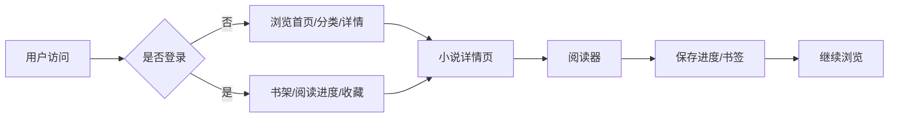

# 业务需求文档（BRD）

## 文档信息

| 项目 | 内容 |
|------|------|
| 项目名称 | HARNESS_TEST — 云阅阅读 |
| 文档编号 | BRD-001 |
| 版本 | v1.0 |
| 创建日期 | 2026-08-10 |
| 产品经理 | wangjitao |

---

## 1. 业务背景与目标

### 1.1 业务背景

随着移动互联网普及，在线阅读成为用户获取小说内容的主要方式。起点中文网、番茄小说、微信读书等平台验证了在线小说阅读市场的巨大潜力。本项目旨在构建一个功能完善、体验优良的小说阅读网站，提供从发现、浏览、阅读到管理的全流程服务。

### 1.2 业务目标

| 目标类型 | 目标描述 | 衡量指标 |
|---------|---------|---------|
| 业务目标 | 搭建小说阅读平台，吸引用户并建立阅读生态 | 月活用户 ≥ 10万（上线3个月） |
| 用户目标 | 提供流畅、沉浸式的小说阅读体验 | 用户平均阅读时长 ≥ 30分钟/天 |
| 产品目标 | 覆盖小说阅读全链路核心功能 | 核心功能完成率 100% |

### 1.3 业务范围

**本期范围（MVP / V1.0）**：
- 用户发现小说：首页推荐、分类浏览、搜索
- 用户阅读小说：阅读器、阅读设置、阅读进度保存
- 用户管理：注册/登录、书架、阅读历史
- 平台运营：后台管理（内容审核、用户管理、数据监控）
- 平台基础：响应式设计、性能、安全

**不包含在本期范围内**：
- 付费阅读 / VIP 会员（V1.3+）
- 广告系统（V1.3+）
- 第三方登录（V1.3+）
- 听书 / TTS（远期）
- 多语言 / 国际化（远期）

---

## 2. 业务角色

| 角色 | 职责 | 使用频率 |
|------|------|---------|
| 普通读者 | 发现、阅读、收藏、评论小说 | 高（占比 85%） |
| 重度读者 | 追更、多书管理 | 中（占比 10%） |
| 作者 | 发布章节、管理作品 | 低（占比 3%） |
| 平台管理员 | 内容审核、用户管理、数据监控 | 低（占比 2%） |

---

## 3. 业务模块划分

```
云阅阅读
├── M01 小说发现与浏览
│   ├── M01-01 首页推荐
│   ├── M01-02 分类浏览
│   └── M01-03 搜索
├── M02 小说阅读体验
│   ├── M02-01 阅读器
│   ├── M02-02 阅读设置（字号/主题）
│   └── M02-03 书签与预加载
├── M03 小说详情与互动
│   ├── M03-01 小说详情页
│   └── M03-02 评论与评分（V1.2）
├── M04 用户管理
│   ├── M04-01 注册/登录
│   └── M04-02 书架管理
├── M05 后台管理
│   ├── M05-01 内容审核
│   └── M05-02 用户与运营
└── M06 平台基础
    ├── M06-01 响应式与安全
    └── M06-02 性能与可用性
```

---

## 4. 业务流程总览



---

## 5. 业务规则摘要

详见 [业务规则-harness_test.md](业务规则-harness_test.md)。

核心规则：
- 推荐按热度排序，每小时更新。
- 分类切换时保持当前排序。
- 阅读进度精确到章节 + 字符偏移。
- 小说评分 = 有效评论评分的算术平均值。
- 管理员不可修改自己的角色。
- 连续登录失败 5 次锁定 30 分钟。

---

## 6. 风险识别

| 风险编号 | 风险描述 | 影响 | 应对措施 |
|---------|---------|------|---------|
| R-001 | 内容版权问题 | 高 | MVP 阶段使用公版书/授权内容，建立审核机制 |
| R-002 | 作者中心未在 MVP 实现 | 中 | 通过后台录入 + 种子作者 + 预置数据初始化 |
| R-003 | 推荐算法数据不足 | 中 | 新用户采用热度排行榜冷启动 |
| R-004 | 并发量大导致性能下降 | 中 | 章节预加载、缓存、限流 |
| R-005 | 评论内容合规风险 | 中 | 敏感词过滤 + 用户举报 + 管理员审核 |
| R-006 | 用户密码泄露 | 高 | bcrypt 加密、HTTPS、JWT Token |

---

## 7. 验收标准

### 7.1 MVP 阶段验收标准

| 验收项 | 验收标准 | 验收方式 |
|--------|---------|---------|
| 首页推荐 | 展示热门、最近更新、完本精选，每区 ≥ 6 本 | 功能测试 |
| 分类浏览 | 支持 9 大分类，4 种排序，无限滚动 | 功能测试 |
| 小说详情 | 展示封面、简介、评分、章节列表，支持加入书架 | 功能测试 |
| 阅读器 | 字号 14-32px、3 种主题、翻页响应 < 200ms、键盘快捷键 | 功能/性能测试 |
| 用户系统 | 注册/登录、密码校验、记住我、登录锁定 | 功能测试 |
| 书架 | 展示正在阅读/收藏/历史，点击跳转详情 | 功能测试 |
| 后台管理 | 内容审核、用户管理、数据看板可用 | 功能测试 |
| 响应式 | 适配 PC/平板/手机 | 兼容性测试 |

### 7.2 性能验收标准

| 指标 | 要求 |
|------|------|
| 首页加载时间 | < 2秒 |
| 章节加载时间 | < 500ms |
| 翻章响应时间 | < 200ms |
| 并发用户数 | ≥ 1000 |

---

## 8. 假设与约束

### 8.1 假设

- MVP 阶段内容可通过后台录入和预置公版书获取。
- 用户主要使用中文。
- 目标用户以移动端为主。

### 8.2 约束

- 浏览器兼容性：Chrome 90+、Firefox 90+、Safari 14+、Edge 90+。
- 开发周期：MVP 4 周。
- 商业化功能延迟到 V1.3+。

---

**产品经理**：wangjitao  
**最后更新**：2026-08-10
