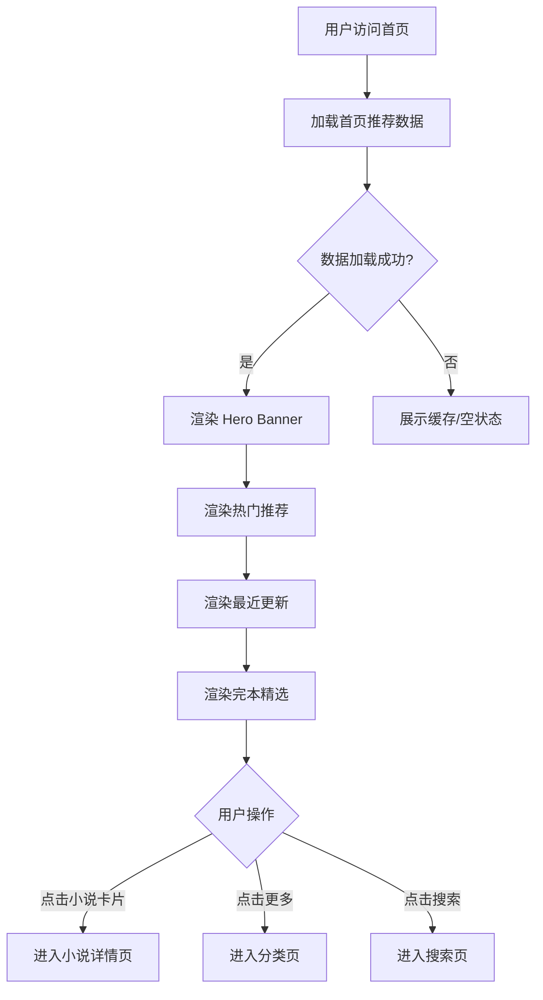
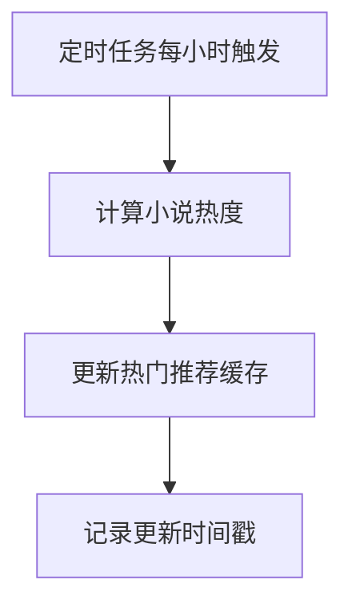

# M01-01 首页推荐 — 业务流程图

## 用户访问首页流程

```mermaid
flowchart TD
    A[用户访问首页] --> B[加载首页推荐数据]
    B --> C{数据加载成功?}
    C -->|是| D[渲染 Hero Banner]
    C -->|否| E[展示缓存/空状态]
    D --> F[渲染热门推荐]
    F --> G[渲染最近更新]
    G --> H[渲染完本精选]
    H --> I{用户操作}
    I -->|点击小说卡片| J[进入小说详情页]
    I -->|点击更多| K[进入分类页]
    I -->|点击搜索| L[进入搜索页]
```

## 推荐数据更新流程

```mermaid
flowchart TD
    A[定时任务每小时触发] --> B[计算小说热度]
    B --> C[更新热门推荐缓存]
    C --> D[记录更新时间戳]
```
