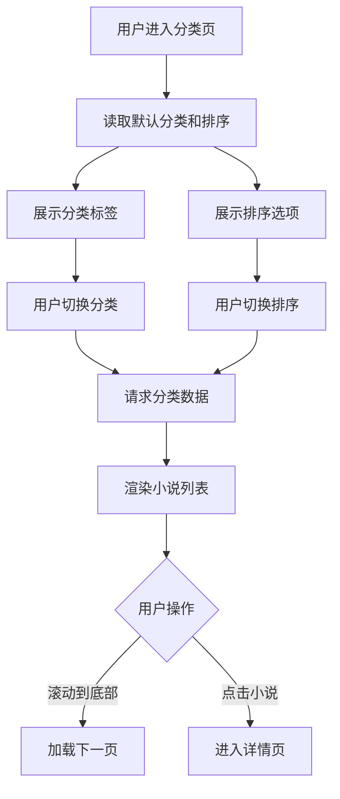

# M01-02 分类浏览 — 业务流程图

## 分类浏览流程

```mermaid
flowchart TD
    A[用户进入分类页] --> B[读取默认分类和排序]
    B --> C[展示分类标签]
    B --> D[展示排序选项]
    C --> E[用户切换分类]
    D --> F[用户切换排序]
    E --> G[请求分类数据]
    F --> G
    G --> H[渲染小说列表]
    H --> I{用户操作}
    I -->|滚动到底部| J[加载下一页]
    I -->|点击小说| K[进入详情页]
```
