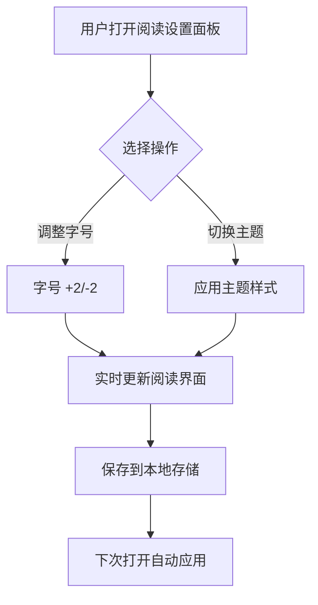

# M02-02 阅读设置 — 业务流程图

## 阅读设置调整流程

```mermaid
flowchart TD
    A[用户打开阅读设置面板] --> B{选择操作}
    B -->|调整字号| C[字号 +2/-2]
    B -->|切换主题| D[应用主题样式]
    C --> E[实时更新阅读界面]
    D --> E
    E --> F[保存到本地存储]
    F --> G[下次打开自动应用]
```
