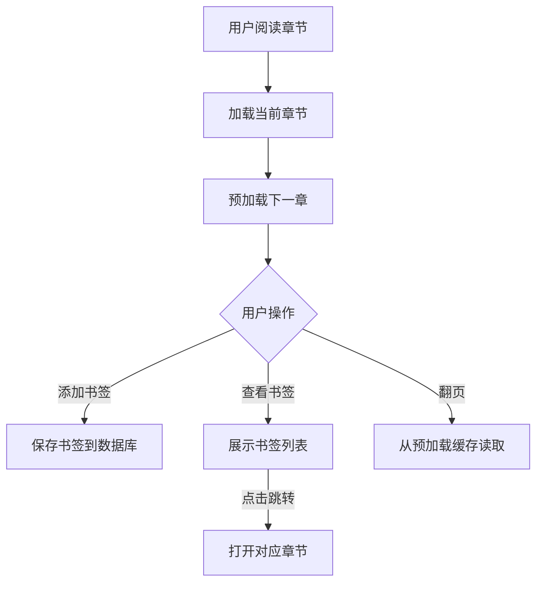

# M02-03 书签与预加载 — 业务流程图

## 书签与预加载流程

```mermaid
flowchart TD
    A[用户阅读章节] --> B[加载当前章节]
    B --> C[预加载下一章]
    C --> D{用户操作}
    D -->|添加书签| E[保存书签到数据库]
    D -->|查看书签| F[展示书签列表]
    D -->|翻页| G[从预加载缓存读取]
    F -->|点击跳转| H[打开对应章节]
```
