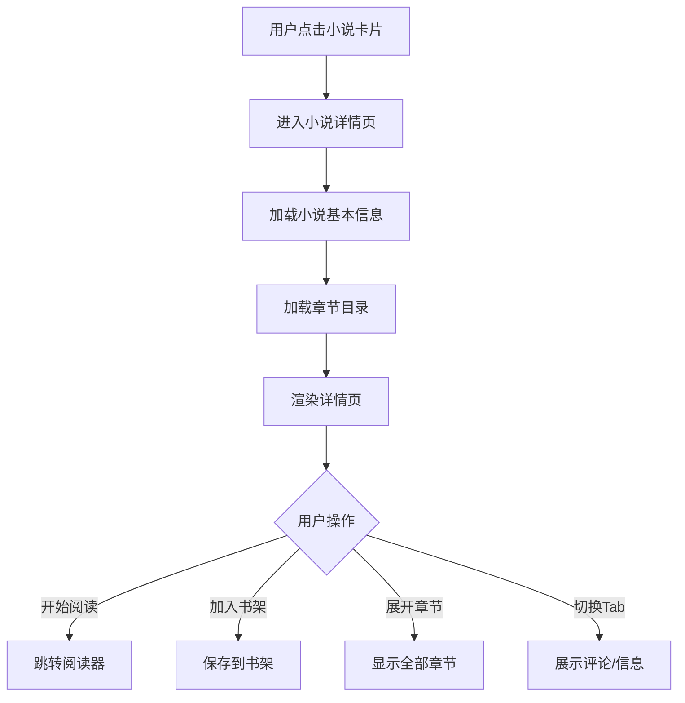

# M03-01 小说详情页 — 业务流程图

## 详情页访问流程

```mermaid
flowchart TD
    A[用户点击小说卡片] --> B[进入小说详情页]
    B --> C[加载小说基本信息]
    C --> D[加载章节目录]
    D --> E[渲染详情页]
    E --> F{用户操作}
    F -->|开始阅读| G[跳转阅读器]
    F -->|加入书架| H[保存到书架]
    F -->|展开章节| I[显示全部章节]
    F -->|切换Tab| J[展示评论/信息]
```
