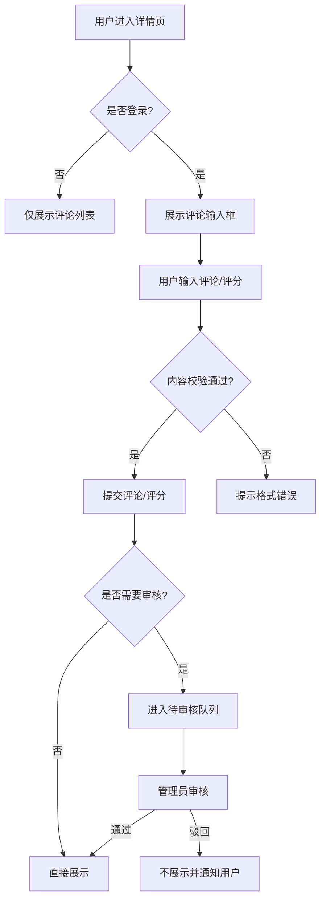

# M03-02 评论与评分 — 业务流程图

## 评论评分流程

```mermaid
flowchart TD
    A[用户进入详情页] --> B{是否登录?}
    B -->|否| C[仅展示评论列表]
    B -->|是| D[展示评论输入框]
    D --> E[用户输入评论/评分]
    E --> F{内容校验通过?}
    F -->|是| G[提交评论/评分]
    F -->|否| H[提示格式错误]
    G --> I{是否需要审核?}
    I -->|是| J[进入待审核队列]
    I -->|否| K[直接展示]
    J --> L[管理员审核]
    L -->|通过| K
    L -->|驳回| M[不展示并通知用户]
```
