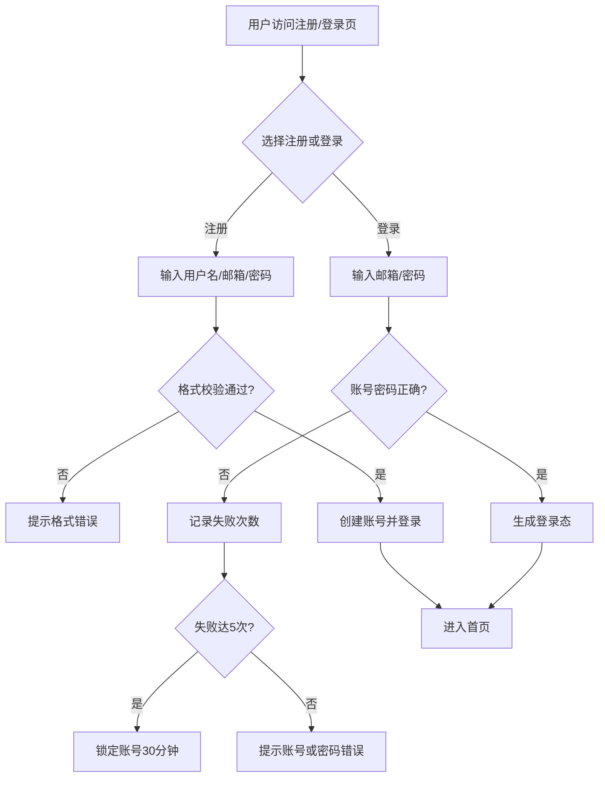

# M04-01 注册登录 — 业务流程图

## 注册登录流程

```mermaid
flowchart TD
    A[用户访问注册/登录页] --> B{选择注册或登录}
    B -->|注册| C[输入用户名/邮箱/密码]
    B -->|登录| D[输入邮箱/密码]
    C --> E{格式校验通过?}
    D --> F{账号密码正确?}
    E -->|否| G[提示格式错误]
    F -->|否| H[记录失败次数]
    H --> I{失败达5次?}
    I -->|是| J[锁定账号30分钟]
    I -->|否| K[提示账号或密码错误]
    E -->|是| L[创建账号并登录]
    F -->|是| M[生成登录态]
    L --> N[进入首页]
    M --> N
```
