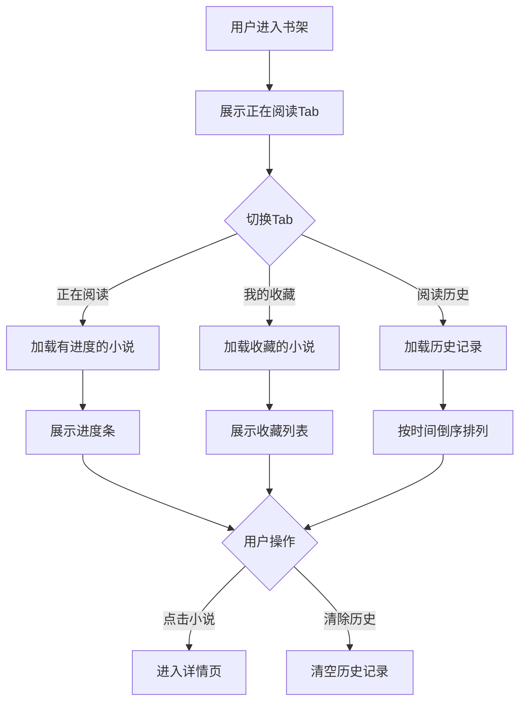

# M04-02 书架管理 — 业务流程图

## 书架管理流程

```mermaid
flowchart TD
    A[用户进入书架] --> B[展示正在阅读Tab]
    B --> C{切换Tab}
    C -->|正在阅读| D[加载有进度的小说]
    C -->|我的收藏| E[加载收藏的小说]
    C -->|阅读历史| F[加载历史记录]
    D --> G[展示进度条]
    E --> H[展示收藏列表]
    F --> I[按时间倒序排列]
    G --> J{用户操作}
    H --> J
    I --> J
    J -->|点击小说| K[进入详情页]
    J -->|清除历史| L[清空历史记录]
```
