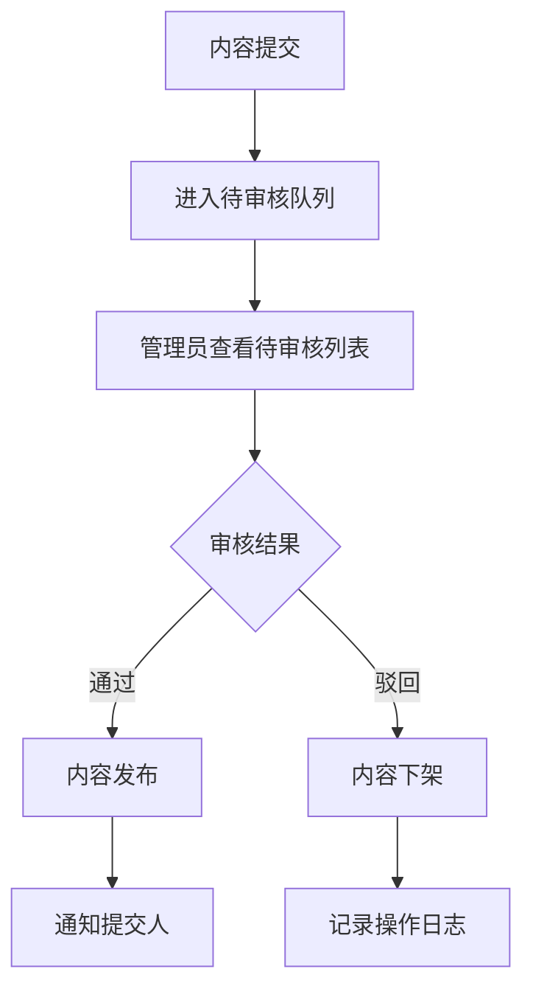

# M05-01 内容审核 — 业务流程图

## 内容审核流程

```mermaid
flowchart TD
    A[内容提交] --> B[进入待审核队列]
    B --> C[管理员查看待审核列表]
    C --> D{审核结果}
    D -->|通过| E[内容发布]
    D -->|驳回| F[内容下架]
    F --> G[记录操作日志]
    E --> H[通知提交人]
```
