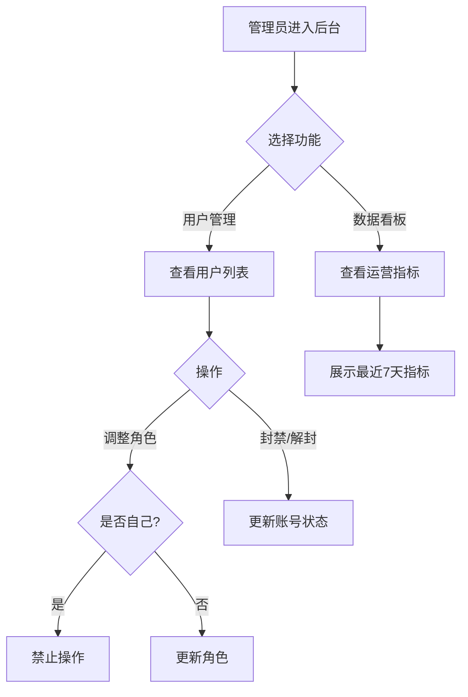

# M05-02 用户与运营 — 业务流程图

## 用户与运营流程

```mermaid
flowchart TD
    A[管理员进入后台] --> B{选择功能}
    B -->|用户管理| C[查看用户列表]
    B -->|数据看板| D[查看运营指标]
    C --> E{操作}
    E -->|调整角色| F{是否自己?}
    F -->|是| G[禁止操作]
    F -->|否| H[更新角色]
    E -->|封禁/解封| I[更新账号状态]
    D --> J[展示最近7天指标]
```
