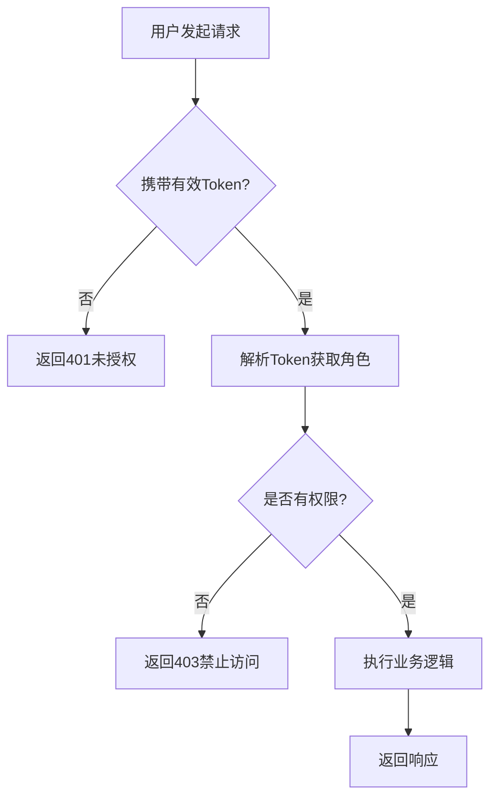

# M06-01 响应式与安全 — 业务流程图

## 请求认证流程

```mermaid
flowchart TD
    A[用户发起请求] --> B{携带有效Token?}
    B -->|否| C[返回401未授权]
    B -->|是| D[解析Token获取角色]
    D --> E{是否有权限?}
    E -->|否| F[返回403禁止访问]
    E -->|是| G[执行业务逻辑]
    G --> H[返回响应]
```
